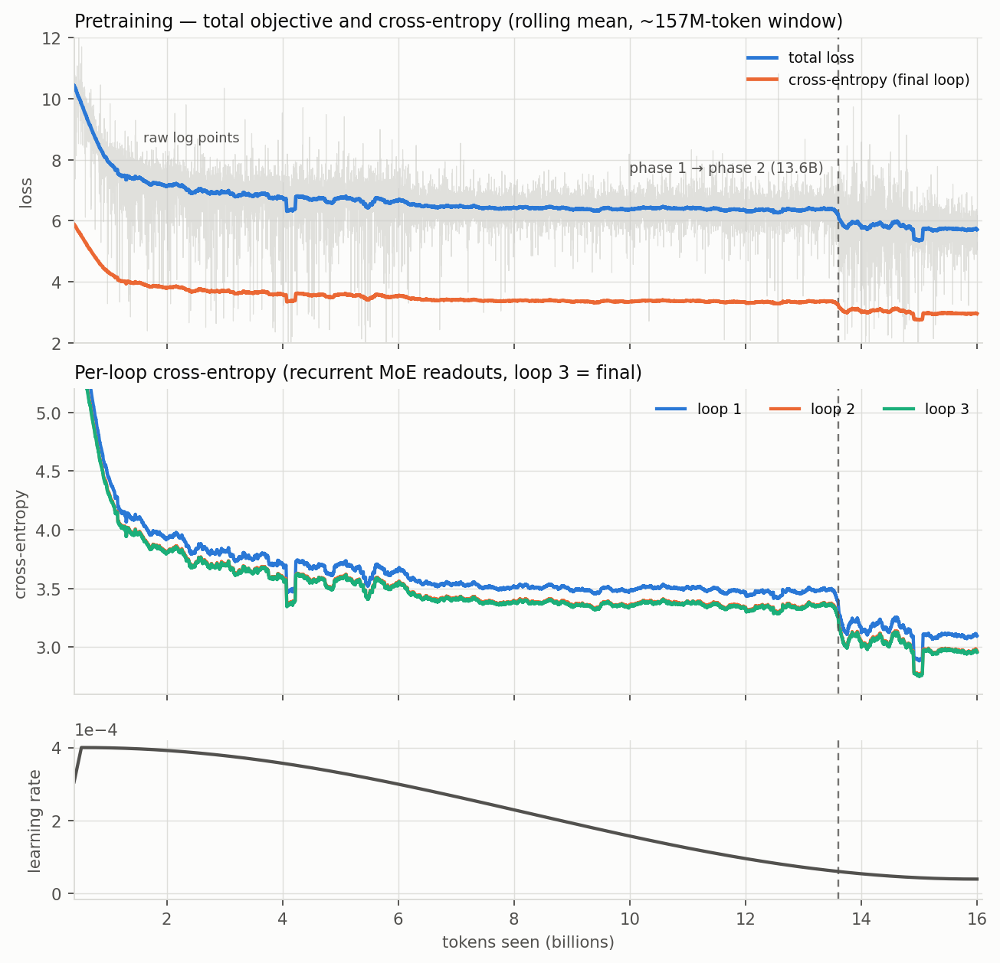
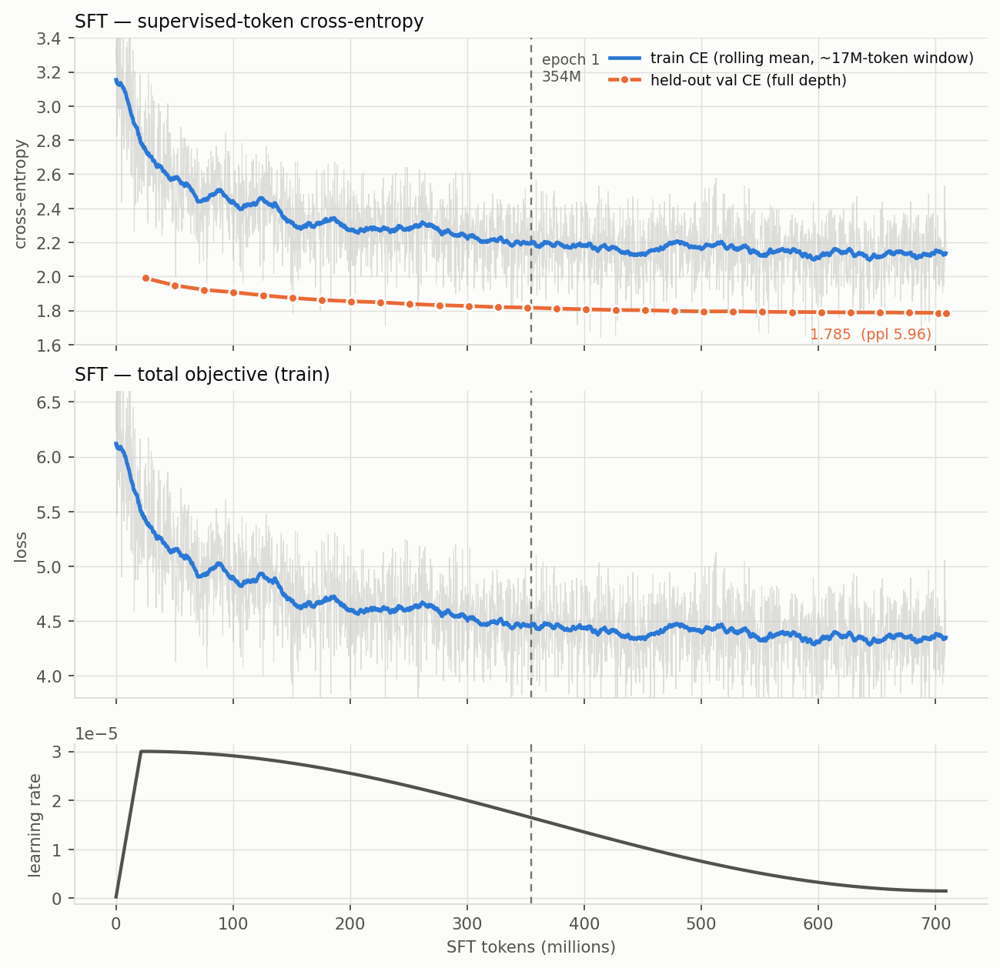
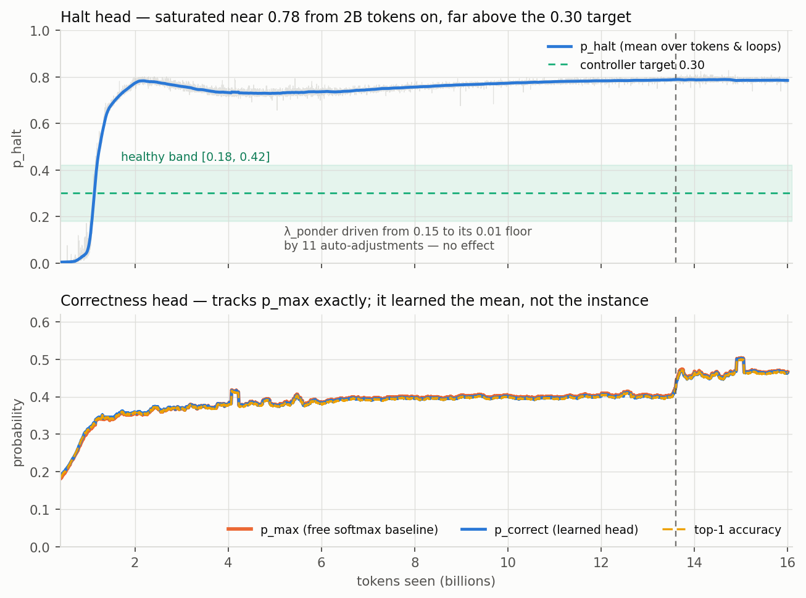

# tiny-moe-llm — run conclusion (`temp-train`)

Single unattended cloud run: 16.0B tokens of pretraining across two data phases on one H100 NVL,
followed by a 2-epoch local SFT pass and the SQuAD v2 abstention acceptance eval. Everything below
is read off `logs/train.log`, `sft/sft_chain.log`, `sft/sft_prep.log`, `manifest.json` and
`sft/abstention_eval.json`.

---

## Model

| | |
|---|---|
| Total parameters | **332,324,717** (332.3M) |
| Active / token | **173.1M** (103.9M excluding all embedding tables) |
| Forward FLOPs / token | **~490M** = body 264M + heads 100M + attention 126M @ `seq_len=4096` |
| Dense decoder | 8 layers, `hidden=768`, 12 heads × `head_dim=64` (GQA), `intermediate=2304`, per-layer embeddings 32 |
| Recurrent MoE | 1 block applied **3 loops**, `moe_intermediate=2304` |
| Expert pool (35, one router) | 1 self-attn + 1 cross-attn + 1 IR + 32 MLP, `top_k=2`, plus always-on shared MLP + shared attn |
| IR expert | 8192 entries × 128-dim keys/values, 768→128→768 projections (~2.3M params) |
| Heads | MTP (2 extra tokens), per-loop LM head (`lm_head_factor=4`), halt head, correctness head |
| Vocab / context | 65,536 (pruned DeepSeek tokenizer: 64,256 base + 1,280 added) / 4,096 |
| Precision | **BF16** — `USE_FP8` was never set, so the H100's FP8 path went unused |
| Optimizer | AdamW, 185 decayed tensors (`wd`), 44 undecayed (norms/biases/gates) via fp32 masters |

Gap between total and active params is the routed MLP pool: 32 experts exist, 2 run per token.

---

## Phase 1 — broad web pretraining

- **Data**: `phase1.bin`, 22,641,408 documents / 49.40 GB / 24.70B tokens available. Mix:
  FineWeb-Edu 59.9%, Stack-Edu code 13.8%, DCLM 11.5%, FinePDFs-Edu 8.0%, Nemotron-CC-Math 3.4%,
  Wikipedia 3.4%.
- **Consumed 13.60B tokens** (85% of the 16B budget) — a single pass over ~55% of the prepared
  corpus, no repeats.
- **Schedule**: `lr=4e-4`, 1,000-step linear warmup → cosine to `4e-5`; `wd=0.02`, grad clip 1.0;
  batch 8 × 4096 × accum 16 = **524,288 tokens/optimizer step**, 30,517 total scheduled steps.
- **LR progression**: 1.2e-5 at step 0 → **4.0e-4** peak at ~0.5B tokens → **6.09e-5** at the
  phase-1 boundary.
- **Loss progression** (final-loop CE): 11.13 → 4.30 by 1B → 3.70 by 3B → 3.41 by 7B → **3.359**
  at 13.6B (**ppl 28.8**). Total objective 18.95 → **6.40**. Top-1 accuracy 0 → 39.6%.
- Most of the descent is over by ~3B tokens; 3B→13.6B buys 0.34 nats.
- **Runtime**: ~38.9 h across 3 launches — a deliberate `STOP` at 1.43B, one dataloader-worker
  kill (exit 1) at 1.50B that the supervisor relaunched automatically, then 34.6 h uninterrupted.
  ~97K tokens/s, **MFU ~11%**, peak memory ~29 GB.

## Phase 2 — curriculum shift

- **Data**: `phase2.bin`, 4,671,193 documents / 9.00 GB / 4.50B tokens. Mix rebalanced toward
  reasoning: Nemotron-CC-Math 30%, Stack-Edu code 22%, FineWeb-Edu 15%, smoltalk2 15%,
  FinePDFs-Edu 10%, Wikipedia 8%.
- **Consumed 2.40B tokens** (13.60B → 16.00B). Identical hyperparameters; the cosine *continues*
  rather than restarting, so LR runs **6.09e-5 → 4.0e-5** (the floor).
- **Loss progression**: an immediate step change at the corpus switch — final-loop CE 3.359 →
  3.046 within ~200M tokens, then near-flat to **2.969** (**ppl 19.5**). Total objective
  6.40 → **5.73**. Top-1 39.6% → 46.0%.
- Read the drop as a *distribution* change (phase-2 data is easier to predict), not 2.4B tokens of
  learning: the curve is flat over the last ~1.4B.
- **Runtime**: 6.85 h, uninterrupted. Combined pretraining wall clock **~45.7 h**.

**Per-loop readouts at the end**: loop 1 = 3.109, loop 2 = 2.969, loop 3 = 2.969. The recurrence
saturates after two loops — the third pass contributes nothing measurable. `loop_scale` grew from
its 0.578 init to [1.73, 1.81, 1.32].

**Routing**: the load-balancing aux loss sat at ~1.0 (its balanced value) from step 0 to the end
and mean routed weight is flat across all 35 experts, so the router never specialized strongly;
per-token selection fractions do spread (0.03–0.24 during pretraining, tightening to 0.05–0.10
after SFT — see `graphs/expert_selection.png` and `sft/graphs/expert_selection.png`).

## SFT

- **Corpus** (`scripts/prepare_sft_data.py`, 500M target, **358.8M realized** — sources ran dry):
  smoltalk2 175.3M (48.9%), UltraChat 100.0M (27.9%), Tulu-3-personas-math 50.0M (14.0%),
  SQuAD v2 26.8M (7.5%), No-Robots 5.3M (1.5%), GSM8K 1.35M (0.4%).
  1,036,322 smoltalk2 conversations excluded as phase-2 pretraining holdout.
- **Splits**: `sft_train` 508,241 conversations / 355.3M tokens / 265.9M supervised (74.8%);
  `sft_val` 5,117 conversations / 3.53M tokens.
- **Schedule**: 2 epochs = **708.9M tokens**; `lr=3e-5` (3% warmup, cosine to 5% floor →
  3.0e-7 → 3.0e-5 → 1.5e-6), `wd=0.01`, `dropout=0.05`, batch 8 × 4096 × accum 4 =
  131,072 tokens/step. **Every** parameter stepped through an fp32 master (at 3e-5 a bf16 AdamW
  step is below the weight's own ulp).
- Pretraining loss weights reused verbatim (`pretrain.train_step`), so the halt and correctness
  heads kept being supervised, and the global token counter continued rather than resetting.
- **Loss progression**: train CE 3.25 → 2.20 (end of epoch 0) → **2.14**; total 6.22 → **4.38**.
  Held-out val CE **1.990 → 1.785** (ppl 7.32 → **5.96**), top-1 58.8% → **62.1%**.
  Epoch 2 contributes ~0.03 nats — essentially converged after one pass.
- The ~0.35-nat train/val gap is mostly `dropout=0.05` being active in training and off at eval.
- **Runtime**: ~5.7 h local, ~35K tokens/s.

---

## Figures

All regenerated from the raw log points with a centred rolling mean (the per-step curves in
`graphs/loss_graph.png` are dominated by stochastic-depth noise and are not readable).







---

## Failure: the abstention mechanism (both heads)

The acceptance eval (`scripts/eval_abstention.py`, all 11,873 SQuAD v2 validation questions, 50.1%
unanswerable, greedy, `--max-new-tokens 32`) shows the model learned to **refuse almost everything**.

| Metric | Value |
|---|---|
| Overall abstention rate | **80.2%** (9,521 / 11,873) |
| Abstention rate, unanswerable | 82.0% |
| Abstention rate, **answerable** | **78.4%** ← the degenerate tell |
| Abstention precision / recall / F1 | 0.512 / 0.820 / 0.630 |
| Exact match, answerable half | 0.055 (0.254 among the 21.6% it actually attempted) |
| Overall correctness | 0.438 |

- **Precision 0.512 ≈ the 0.501 base rate of unanswerable questions.** The decision to abstain
  carries essentially no information: a 3.6 pp gap between unanswerable and answerable.
- **The generation head collapsed onto one string.** 7,786 of 11,873 completions are literally
  `"The passage doesn't say."`, and five fixed phrasings account for all 80.2% of completions that
  abstain. Mean generation length 7.5 tokens.
- **The correctness head (`p_correct`) never became an independent signal.** Across the whole of
  pretraining it tracks the free `p_max` baseline to within 0.005 (bottom panel of
  `heads_diagnostics.png`) — it learned the *marginal* accuracy, not the *instance*. On the eval:
  answer-level ECE 0.378 (`p_max` 0.371 — the free baseline still wins, as it did at Gate 5),
  AUROC 0.604, and AUROC of `1 − p_correct` for detecting unanswerable questions is **0.457, worse
  than chance**. Worse still, mean `p_correct` is *higher* on abstentions (0.835) than on real
  answers (0.739): the model is most confident when refusing.
- **The halt head (`p_halt`) saturated and the ponder controller had no authority.** It collapsed
  to ~0.004 during the zero-λ warmup (pure CE pressure), then overshot to **~0.78** the moment the
  ponder ramp engaged and stayed there for 14B tokens. The auto-adjust controller cut
  `lambda_ponder` **11 times**, 0.15 → its 0.01 floor, with no measurable effect — once CE has no
  gradient w.r.t. `p_halt`, λ is not a control knob. The loop compensated by growing `loop_scale`
  instead. Net effect: the halt signal is a constant, so it can neither drive early exit nor feed
  an abstention policy.
- **Token-level calibration "passed" and is misleading.** Teacher-forced on the same prompts, the
  SFT checkpoint reads CE 0.817 / top-1 0.836 / ECE(`p_correct`) 0.026, vs the pretrained baseline's
  0.049 — a PASS on "ECE does not degrade". That measures next-token confidence on a *given*
  reference string; it says nothing about whether the answer-level decision was right, which is why
  it passes while the behavioural metric fails.

### Root causes

1. **The SFT mix rewards refusal.** SQuAD v2 is only 7.5% of tokens but **25.6% of conversations**
   (130,319 of 508,241), and its unanswerable third is a ~6-token, extremely low-entropy target.
   Per-token CE makes short refusals the cheapest loss reduction available; nothing in the corpus
   penalizes refusing an answerable question.
2. **`is_correct` is a leaky target.** It is derived from the same chunk's teacher-forced argmax,
   i.e. a near-deterministic function of the logits the head already shares a hidden state with.
   The head can hit the BCE optimum by reproducing `p_max`, which is exactly what it did.
3. **`p_halt` gates the loop's *output*, not its *compute*.** Every expert runs regardless, so
   halting buys nothing back and the only pressure on it is a hand-tuned λ.

### Viable fixes

- **Rebalance and re-run SFT** (cheapest, ~6 h): cap unanswerable at ~10–15% of the QA subset, add
  answerable-only extractive QA (SQuAD 1.1, NQ-open, TriviaQA, HotpotQA), and weight the loss
  **per conversation** rather than per token so a 6-token refusal stops out-earning a real answer.
- **A short targeted repair finetune** on the existing SFT checkpoint (~20–50M tokens, `lr=1e-5`,
  1 epoch) over a balanced answerable/unanswerable set. The model is already chat-formatted, so
  this is hours, not days — the highest value-per-GPU-hour option.
- **A preference pass (DPO / ORPO)** on pairs of (correct extractive answer, abstention) for
  answerable questions and the reverse for unanswerable ones. CE cannot see the degenerate policy;
  a pairwise objective can, and it is the standard fix for exactly this collapse.
- **Decouple abstention from generation.** Freeze the backbone and fit a small calibrated probe
  (final hidden state + `p_max`, entropy, margin) on a held-out answerable/unanswerable set, then
  abstain by threshold. Minutes of compute, and it gives a tunable precision/recall operating point
  instead of a single baked-in policy.
- **Fix the correctness head's supervision** if it is kept at all: target *sampled* continuations
  rather than teacher-forced tokens so it sees its own error distribution; make the target
  sequence-level ("was the whole answer right") rather than per-token; and give it the logit
  features explicitly so it must *add* information over `p_max` rather than reproduce it. Gate 5's
  original revert criterion (`p_correct` must beat `p_max` on ECE **and** AUROC) has now failed on
  the real final checkpoint too — **as specified, the head, its loss term and `lambda_conf` should
  be reverted** unless one of the above redesigns is tried.
- **Halt head**: replace the λ-nudge controller with a Lagrangian on an explicit budget constraint,
  or switch to cumulative ACT with halting probabilities normalized across loops. Better still,
  make halting actually **skip** the loop at inference so there is a genuine compute/quality
  trade-off to learn. Given that loop 3 already contributes ~0 nats, a 2-loop model is the honest
  baseline to beat.

---

## Information-retrieval expert — extension path

**Current state.** One IR expert: `down_proj` 768→128, a learned table of 8192 key/value pairs at
`ir_dim=128`, cosine-similarity softmax over the whole table, `up_proj` 128→768. ~2.3M parameters,
~5% of forward FLOPs (the config notes it was halved from 16384 entries pre-run, where it was
~11%). It runs densely on every token, every loop; the router only weights its contribution.

**What the run shows.** The router *wants* it: reading the selection-fraction bars, its gate sits
at ~7% of tokens after pretraining and ~9% after SFT, against a 5.7% uniform share (2/35) — one of
the three most-selected slots in the pool. But there is a design problem limiting what it can
deliver:

> Similarity is **cosine**, so logits are bounded in [−1, 1], and `temperature=1.0`. A softmax over
> 8192 entries whose logits span at most 2.0 is nearly uniform — the retrieved vector is close to a
> constant `mean(y_values)`. The expert is likely operating as a learned bias plus a projection,
> not as retrieval.

**Extensions, cheapest first — all reachable by finetuning, none require retraining from scratch:**

1. **Lower the retrieval temperature** (`temperature` ≈ 0.05–0.1, or make it a learned scalar and
   anneal it). This is a *scalar*, not a shape: the existing checkpoint loads unchanged. It should
   be the first experiment — it turns a near-uniform average into actual selection, and it is
   free.
2. **Sparsify the read** (top-k ≈ 32 instead of a full softmax). Cost drops from a dense
   8192 × 128 matmul to a gather, which is what makes item 3 affordable.
3. **Grow the table.** `z_keys` and `y_values` are plain `[num_entries, ir_dim]` parameters —
   append rows, initialize the new ones from the existing distribution, and load the old checkpoint
   with `strict=False` on just those two tensors. Every projection shape is untouched. 8192 →
   65,536 entries is ~16.8M extra parameters (~34 MB bf16) and, with top-k reads, roughly flat
   FLOPs.
4. **Warm-start the table from real knowledge** rather than noise: `z_keys` from encoded
   entity/definition text, `y_values` fit to what the LM should emit there. Converts random memory
   into an index.
5. **IR-only finetune**: freeze everything except `z_keys` / `y_values` / `g_proj` and run a
   factual corpus (Wikipedia, TriviaQA) at a higher LR for those tensors alone. The rest of the
   model is trained; the table is precisely the component that should absorb facts, and isolating
   it avoids disturbing the chat behaviour.
6. **More IR experts** (`num_ir_experts > 1`) is the one invasive option: it shifts
   `first_mlp_index` and the router's output dimension, so it needs a surgical remap of the router
   weight and the expert list rather than a plain checkpoint load. Prefer 1–5 first.

---

## Artifacts

```
config.yaml                                the exact config this run used
manifest.json                              data-prep provenance (source revisions, realized token
                                             counts per source, smoltalk2 holdout hashes)
logs/train.log                             full pretraining log (both phases, all relaunches)
checkpoints/final/checkpoint_phase{1,2}_final.pt
checkpoints/checkpoint_phase*_tok*.pt      rolling pretraining checkpoints
sft/final/checkpoint_sft_final.pt          the model the eval below was run on
sft/sft_prep.log, sft/sft_chain.log        SFT corpus build + training/eval chain
sft/abstention_eval.json                   11,873 per-question records (completion, p_correct,
                                             p_max, abstained, EM/F1) + calibration summaries
sft/corpus/sft_{train,val}.{bin,idx,mask}  the tokenized SFT corpus
graphs/pretrain_loss.png, graphs/sft_loss.png, graphs/heads_diagnostics.png
graphs/expert_selection.png, sft/graphs/expert_selection.png
```
